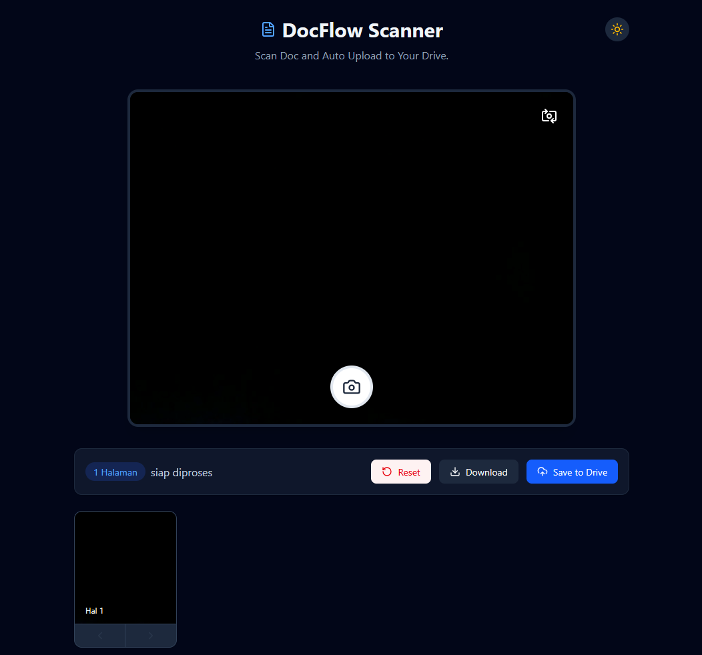

# DocFlow Scanner

A web-based document scanner built with Next.js. Capture documents with your device camera, fix perspective with 4-corner correction, apply a CamScanner-style high-contrast filter, reorder pages, then export a watermarked PDF or upload it straight to Google Drive.

Live demo: [docflow-jade.vercel.app](https://docflow-jade.vercel.app)



## Features

- **Camera capture** — front/back camera switching via `react-webcam`.
- **4-corner perspective correction** — drag the four corner handles over the document; the image is de-warped using a triangle-based affine transform on a `<canvas>`.
- **CamScanner-style filter** — one-tap high-contrast grayscale to make text crisp.
- **Multi-page management** — reorder pages by drag-and-drop or arrow buttons, delete individual pages, reset all.
- **Watermarked PDF export** — pages are assembled with `pdf-lib` and stamped with a tiled, low-opacity diagonal watermark. Downloads as `DOCFLOW_YYYYMMDD_HHMM.pdf`.
- **Save to Google Drive** — upload the generated PDF to Drive through a server-side OAuth2 route.
- **Dark mode** — light/dark toggle.
- **PWA-ready** — installable on mobile (`next-pwa`).

## Tech Stack

- [Next.js 16](https://nextjs.org) (App Router) + React 19
- TypeScript
- Tailwind CSS v4
- [pdf-lib](https://pdf-lib.js.org) — PDF generation
- [react-webcam](https://github.com/mozmorris/react-webcam) — camera access
- [googleapis](https://github.com/googleapis/google-api-nodejs-client) — Google Drive upload
- [lucide-react](https://lucide.dev) — icons

## Getting Started

### Prerequisites

- Node.js 18+ (Node 20 recommended)
- A Google Cloud project with the Drive API enabled (only needed for the "Save to Drive" feature)

### Install

```bash
git clone https://github.com/alfarissm/docflow.git
cd docflow
npm install
```

### Environment variables

Create a `.env.local` file in the project root:

```env
GOOGLE_CLIENT_ID=your-google-oauth-client-id
GOOGLE_CLIENT_SECRET=your-google-oauth-client-secret
GOOGLE_REFRESH_TOKEN=your-google-refresh-token
```

These power the `/api/drive-upload` route. Without them, capture / filter / PDF download still work — only Drive upload is disabled.

### Run

```bash
npm run dev
```

Open [http://localhost:3000](http://localhost:3000). Camera access requires `https` or `localhost`.

## Google Drive Setup

The app uses a server-side OAuth2 refresh token to upload on behalf of a single Drive account.

1. In [Google Cloud Console](https://console.cloud.google.com), create OAuth credentials (Web application) and enable the **Google Drive API**.
2. Add the redirect URI:
   - Dev: `http://localhost:3000/api/auth/callback`
   - Prod: `https://<your-domain>/api/auth/callback`
3. Set `GOOGLE_CLIENT_ID` and `GOOGLE_CLIENT_SECRET` in `.env.local`.
4. Get the consent URL — `GET /api/upload` returns `{ authUrl }`. Open it, grant access.
5. Google redirects to `/api/auth/callback`, which returns `{ access_token, refresh_token }`. Copy the `refresh_token` into `GOOGLE_REFRESH_TOKEN`.
6. Uploaded files use the `drive.file` scope (the app only sees files it creates).

> Note: the redirect URIs are currently hardcoded to `docflow-jade.vercel.app` for production in `app/api/upload/route.ts` and `app/api/auth/callback/route.ts`. Update them to your own domain when self-hosting.

## How It Works

1. **Capture** — `react-webcam` grabs a JPEG screenshot.
2. **Review** — the shot enters a review view with a draggable 4-corner overlay.
3. **Correct** — `correctPerspectiveFromCorners` maps the selected quad to a rectangle by warping two triangles through an affine transform, removing perspective skew.
4. **Filter** — optional pass that pushes contrast and converts to grayscale per-pixel via `getImageData`.
5. **Assemble** — confirmed pages are embedded into a `pdf-lib` document, each on a page sized to the image, then watermarked.
6. **Export** — download locally or POST the PDF bytes to `/api/drive-upload`, which streams them into Drive.

## Project Structure

```
app/
  layout.tsx                  # Root layout + metadata
  page.tsx                    # Renders <Scanner />
  api/
    upload/route.ts           # GET: build Google OAuth consent URL
    auth/callback/route.ts    # GET: exchange code for tokens
    drive-upload/route.ts     # POST: upload PDF bytes to Drive
components/
  Scanner.tsx                 # All scanner UI + image/PDF logic
```

## Scripts

| Command | Description |
| --- | --- |
| `npm run dev` | Start the dev server |
| `npm run build` | Production build |
| `npm run start` | Run the production build |
| `npm run lint` | Run ESLint |

## Deploy

Optimized for [Vercel](https://vercel.com). Import the repo, set the three `GOOGLE_*` environment variables, and deploy. Remember to add your production redirect URI to the Google OAuth client and update the hardcoded domain in the API routes.

## License

No license specified. All rights reserved by the author unless stated otherwise.
